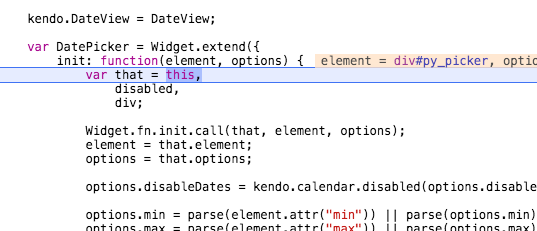
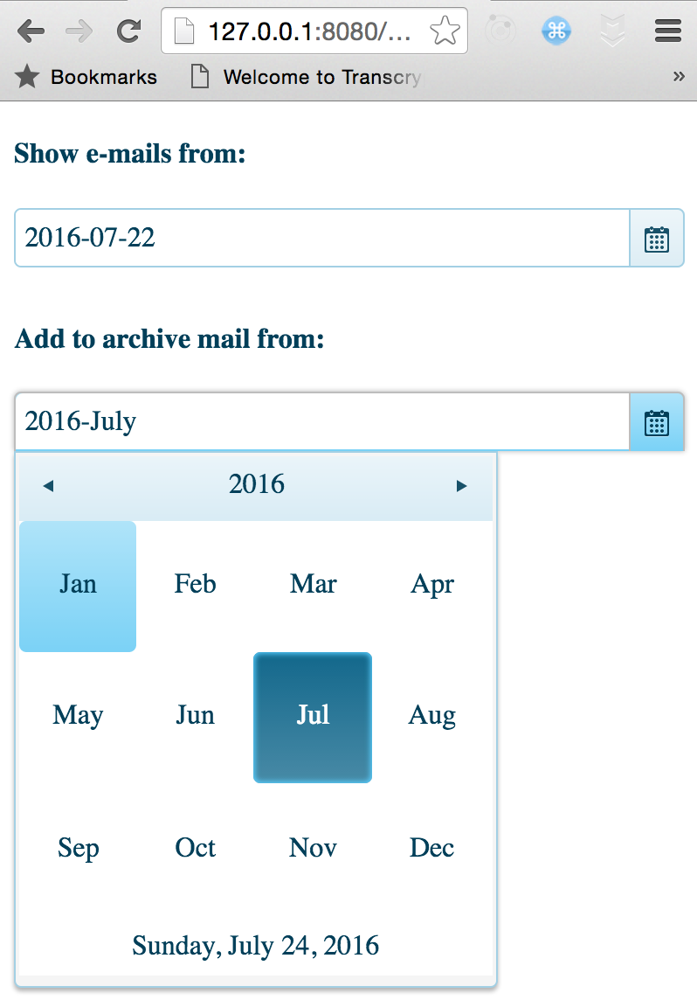

# Chapter 1: A [kendoui](http://demos.telerik.com/kendo-ui/datetimepicker/index) `datetime` Widget


<!-- toc -->

- [Chapter 1: A [kendoui](http://demos.telerik.com/kendo-ui/datetimepicker/index) `datetime` Widget](#chapter-1-a-kendouihttpdemostelerikcomkendo-uidatetimepickerindex-datetime-widget)
	- [Strategy](#strategy)
		- [Preparation](#preparation)
		- [HTML](#html)
		- [Javascript, as is](#javascript-as-is)
		- [Base Class](#base-class)
		- [Reverse Engineering Session: Jquery and Kendo](#reverse-engineering-session-jquery-and-kendo)
			- [Broader View](#broader-view)
		- [Applying To Python](#applying-to-python)
			- [Removing the last Pragma](#removing-the-last-pragma)
		- [Using `__new__`](#using-__new__)
			- [Options: Wrap Into Transcrypt dict](#options-wrap-into-transcrypt-dict)
			- [Mapping values: Using Transcrypts' `property` feature](#mapping-values-using-transcrypts-property-feature)
	- [Working Widget](#working-widget)
	- [Addendum: A New Transcrypt module](#addendum-a-new-transcrypt-module)

<!-- tocstop -->


Here is how I, a reasonable Python programmer but not too familiar with javascript did integrate a jquery based framework, KendoUI, into Transcrypt ("TS" in the following).

<p style="color: blue">
*The following is basically what I wrote down while I did it - and I was on wrong tracks sometimes, e.g. with `__new__`, see below. I did not remove anything once written though, since also wrong tracks might have a learning effect for others new to TS, like me. I do assume good familiarity with Python.*
</p>

----


[This](http://www.telerik.com/blogs/creating-custom-kendo-ui-plugins) explains how the framework originally wants to be extended. Reflects Crockfort's [way](https://www.youtube.com/watch?v=ya4UHuXNygM).

We make use of the infos to reach our goal.

## Strategy
Get JS Style Running, Then understand whats going on via debugger and convert one by one. This first chapter is about how to make a **kendo datepicker** TS-Pythonic.

### Preparation

Have the reloader running, output red error so that we see immediately compile errors.

```
# using entr as a change detector, output red on errors:
$ find . -name '*.py' | entr sh -c 'clear; rm -rf __javascript/* ; transcrypt yt.py || echo  "\033[1;48;5;196m!!!!!!!!!!!!!!!!!!!!!!!!!!!!!!!!!!\033[0m"'
```
*As you can see I do it really prominent in the Terminal otherwise I tend to overlook it and stare at browser console output of code long gone but still run by the browser, when new code did not compile ;-)*


### HTML

```html

<!DOCTYPE html>
<html>

  <head>
    <meta charset="UTF-8" />
    <title>Observable Components</title>
    <link rel="stylesheet" href="lib/kendo.common.min.css" />
    <link rel="stylesheet" href="lib/kendo.blueopal.min.css" />
    <script src="lib/jquery.min.js"></script>
    <!--script src="lib/kendo.ui.core.min.js"></script-->
    <script src="lib/kendo.core.js"></script>
kendo.calendar.js"></script>
    <script src="lib/kendo.popup.js"></script>
    <script src="lib/kendo.datepicker.js"></script>
  </head>

  <body>

    <script src="__javascript__/yt.js"></script>
    hi.
    <div id="js_picker"></div>
    <div id="py_picker"></div>
<script>
 $ (document) .ready (function() {
    // usage, official way
    $("#js_picker").kendoDatePicker()
    // how we want it
    yt.DatePicker().mount('#py_picker')
})
</script>

  </body>
</html>
```

### Javascript, as is

Using TS's `__pragma__('js')__` we add the javascript examples we found in the web directly:

File `yt.py`, all within `__pragma__('js', '{}', ''')` (removed here, not to confuse the markdown syntax highlighter):


```js
  (function($) {
  // shorten references to variables. this is better for uglification
  var kendo = window.kendo,
      ui = kendo.ui,
      Widget = ui.DatePicker

  var MyPicker = Widget.extend({

    init: function(element, options) {

      // base call to widget initialization
      Widget.fn.init.call(this, element, options);

    },

    options: {
      // the name is what it will appear as off the kendo namespace(i.e. kendo.ui.MyPicker).
      // The jQuery plugin would be jQuery.fn.kendoMyPicker.
      name: "MyPicker",
      value: new Date()
      // other options go here

    }

  });

  ui.plugin(MyPicker);

})(jQuery);

```


Running it we get a nice DatePicker in the Browser - and this in the console: `: yt.DatePicker is not a function`

clear.

Lets create it:

### Base Class

all in yt.py, below the js pragma:

```python
class DatePicker:
    def bind(self, el):
        debugger
```
console, stops at breakpoint:

```
> el
"#py_picker"
```
good.

### Reverse Engineering Session: Jquery and Kendo

This is how I worked my way through:

```js
 // using the js way
 28 el = $("#js_picker")
 29 debugger
 30 el.kendoMyPicker()
```
and it jumps into kendo, within the `each` loop:

```js
$.fn[name] = function(options) {
    var value = this, args;(...)
    this.each(function() {
        return new widget(this, options);
                    });
    return value
    }

// these are also interesting, below:
$.fn[name].widget = widget;

$.fn[getter] = function() {
                return this.data(name);
            };
        }
    });
```

#### Broader View

Putting a break on the first `$.fn` line and reloading, we see that *any* widget loaded, e.g. calendar, popup, ... is registering at jquery like this, e.g.:

```js
$.fn['kendoCalendar'] = function(options){
// see above
}
```
Understood, kendo connects/registers with jquery like this. See also [this](https://api.jquery.com/jquery.fn.extend/) - jquery extension mechanics.

Little Test:

```js
$.fn['foo'] = function() {alert('bar')}
$().foo() // -> alert box shown
```

so after all these years I finally learned how jquery is extended and who it works actually:

$ is the 'class' and the instances are built whenever you select stuff `$(<selectors>)`, with all functions in `fn` available, and `fn` is the prototype of jquery.

And kendo registers all its plugins, standard and extended, like this at jquery, with that loop over all matches of a selector (within the brackets of `$(<selector>))`:

```
this.each(function() { return new widget(this, options) }
```

so that e.g. `$('#mydiv').kendoDatePicker({<options>})` works, creating a widget instance at each element matching the selector `#mydiv`.


Indeed, remove the breakpoint at the registration call and put it into `return new widget(this, options);`, reload:

```js
> this
<the div, jquery>
```
again: The `this.each(function() ...` loops over each matching element, instantiates the widget via `new widget(<jquery element>, options)`


### Applying To Python

Into `yt.py` add on top
```
__pragma__ ('alias', 'S', '$')    
```
to have a ref to jquery (see the Transcrypt jquery demo).

Then we add this to our DatePicker:

```python
class DatePicker:                                                                                 
    def bind(self, el):                                                                           
        jels = S(el) # list of jquery wrapped dom elements.                                                                              
        widget = S().kendoDatePicker.widget # see below                                                       
        for jel in jels:                                                                          
            __pragma__('js', '{}', '''                                                            
                    new widget(jel, {})                                                           
                    ''')
```                    
And we get two nice datepickers in the browser, one from the native js, one from TS:


We basically did the same `each` loop over the matched jquery wrapped elements, than in the kendo module, now in python.

How did we find `widget = S().kendoDatePicker.widget `?

Well thats from the code we saw previously: The widget 'classes' (better: plugins) seem to register at jquery like this `$.fn[name].widget = widget;`.


#### Removing the last Pragma

Hmm, we can't call `new` from Transcrypt. What is new doing?

*found out only later that we *CAN* use `new` in TS: `instance = __new__(MyClass(...))` - but I tried to do without - first*

Reverse engineer the `new widget`: `debugger; new widget(jel, {})`, reload, step into:



Tons of resources out there regarding new, it is by convention calling this `init` function, a bit like python does call `__init__` at construction.

And `init` is within the prototype of 'classes' which can be instantiated with 'new'. So just do it:

```python
class DatePicker:
    def bind(self, el):
        jels = S(el)
        widget = S().kendoDatePicker.widget
        for jel in jels:
			# calling init manually, replacment for new:
            widget.prototype.init(jel, {})
```
and it works, still.

...does it?

### Using `__new__`

After trying to add a second TS based datepicker widget we found the problem with just calling init manually but not `__new__`: Click on one opened the other, and the first one was basically not accessible. That behaviour was pretty clear to relate to working on just one instance of the widget. So we did look into the Transcrypt tests - and found `__new__`, pretty simple, pretty pythonic:


```python
new_obj = __new__(Obj(args)) # e.g. d = __new__(Date())
```

That in turn led to changing our code into sth like this:

```python
def mount(self, el):
	jels = jq(el)
	self._widget_cls = jq().kendoDatePicker.widget
	for jel in jels:
		self._jqel = jel
		if self._widget:
			raise Exception("You have more than one match on the selector")
		self._widget = __new__(self._widget_cls(jel, self.opts()))
	# setting the functions into our self, take care of 'this' in the
	# funcs:
	for k in ('enable', 'close', 'destroy', 'readonly', 'max', 'min',
			  'open', 'setOptions'):
		setattr(self, k, getattr(self._widget, k).bind(self._widget))
	return self

```
where

- we changed the `S` as alias for jquery into `jq` via `__pragma__('alias', 'jq', '$')`
- allow only one matching selector to mount the widget
- get the opts as dict from a function, see below
- set widget methods from the kendo datepicker api into self, so that we later can do `mypicker.open()` in python.


#### Options: Wrap Into Transcrypt dict

In any case we want to pass options from plain js when creating a widget. Also we want to define the widget class with the defaults as class vars.

When you call a transcrypted function from plain js you have to know that normal objects are passed - so we wrap into a TS dict, in order to be able to use pythonic operations on them:

```python
def __init__(self, opts, selector):
	 opts = dict(opts) # create Transcrypt dict
	 for k in opts.keys():
		 setattr(self, k, opts[k])
	 self.set_value(self.ts)
	 if selector:
		 self.mount(selector)
```
`set_value` we cover below. As you can see we automount when the caller passes a selector.

And this is then the `opts` function we used above in the mount:

```python
def opts(self):
	 ''' deliver all our non _ params '''
	 __pragma__('js', '{}', '''var r = {}''') # want a plain js obj for kendo
	 for k in dir(self):
		 if not k.startswith('_'):
			 v = self[k]
			 if not tools.jstype(v, 'function'):
				 r[k] = v
	 return r
```

were we feed a plain js object into the kendo widget.

#### Mapping values: Using Transcrypts' `property` feature

We want the widget to understand a unix timestamp as `ts` value which is always in sync with a javascript Date object, which we name `value`.

For this, python property functions and multiple inheritance features come handy. Both fully supported in Transcrypt :-)

1. We say in the widget module `import time, tools`. Regarding `import time` see the addendum to this chapter.

2. Inherit `class DatePicker(tools.PyDate):

3. And create a PyDate class, for everybody else who wants such a ts / value mapping in the future:

```python
import time

def jstype(obj, typ):
   __pragma__('js', '{}', '''
   var t = typeof(obj)''')
   if t == typ:
       return True
   return False

class PyDate:
    '''
    Descendants get a self.value property, which is always in sync
    with an internal self.ts = unixtime'''
    _value = ts = None
    def get_value(self):
        ''' the js Date we return is based on the unixtime ts '''
        if self._value:
            try:
                t = self._value.getTime() / 1000
            except:
                debugger
            if t == self.ts:
                return self._value
        # will set the new self._value to self.ts and return it
        return self.set_value()

    def set_value(self, ts):
        ''' accept none, js data and unix time
        on none our self.ts wins
        '''
        if ts:
            if not jstype(ts, 'number'):
                self._value = ts
                self.ts = ts.getTime() / 1000
                return self._value
            # ts = unixtime:
            self.ts = ts
            self._value = __new__(Date(ts * 1000))
            return self._value
        if not self.ts:
            self.ts = time.time()
        return self.set_value(self.ts)

    value = property(get_value, set_value)

```

As you can see we keep the value as internal `_value` and expose it via property functions for get and set.

Also it is worth to note (again) how simple you can include plain javascript, if sth is not yet supported in Transcrypt (e.g. the typeof js function).

Inheriting from this class we can now do e.g. this:

```javascript
var w = Widget()
w.value = new Date()
```

or

```python
w = Widget()
w.value = time.time()
```

and w's `ts` value will always be set according to the javascript Date object.


## Working Widget

This is the full widget after this chapter, renamed to `datepicker.py`:

```python
$ cat datepicker.py
import time, tools
__pragma__('alias', 'jq', '$')

class DatePicker(tools.PyDate):
    '''
    vim: gx over the url:
    http://docs.telerik.com/kendo-ui/api/javascript/ui/datepicker#fields-options
    '''
    _mod_time = time # ref for plain js
    _widget    = None
    _jqel      = None
    format = 'yyyy-MM-dd'

    def __init__(self, opts, selector):
        opts = dict(opts)
        # value as date time?
        for k in opts.keys():
            setattr(self, k, opts[k])
        self.set_value(self.ts)
        if selector:
            self.mount(selector)

    def opts(self):
        ''' deliver all our non _ params '''
        __pragma__('js', '{}', '''var r = {}''') # want a plain js obj
        for k in dir(self):
            if not k.startswith('_'):
                v = self[k]
                if not tools.jstype(v, 'function'):
                    r[k] = v
        return r

    def mount(self, el):
        jels = jq(el)
        self._widget_cls = jq().kendoDatePicker.widget
        for jel in jels:
            self._jqel = jel
            if self._widget:
                raise Exception("You have more than one match on the selector")
            self._widget = __new__(self._widget_cls(jel, self.opts()))
        # setting the functions into our selfes, take care of 'this' in the
        # funcs:
        for k in ('enable', 'close', 'destroy', 'readonly', 'max', 'min',
                  'open', 'setOptions'):
            setattr(self, k, getattr(self._widget, k).bind(self._widget))
        return self
```

Looks pretty pythonic to me.

This is how you use it:

```html
<!DOCTYPE html>
<html>

  <head>
    <meta charset="UTF-8" />
    <title>Observable Components</title>
    <link rel="stylesheet" href="lib/kendo.common.min.css" />
    <link rel="stylesheet" href="lib/kendo.blueopal.min.css" />
    <script src="lib/jquery.min.js"></script>
    <!--script src="lib/kendo.ui.core.min.js"></script-->
    <script src="lib/kendo.core.js"></script>
    <script src="lib/kendo.data.js"></script>
    <script src="lib/kendo.listview.js"></script>
    <script src="lib/kendo.calendar.js"></script>
    <script src="lib/kendo.popup.js"></script>
    <script src="lib/kendo.datepicker.js"></script>
    <script src="lib/kefir.js"></script>
  </head>

  <body>
    <!-- taken from kendo example page -->
    <div id="example">
        <div class="demo-section k-content">

            <h4>Show e-mails from:</h4>
            <input id="pydatepicker" value="10/10/2011" style="width: 100%" />
            <h4 style="margin-top: 2em;">Add to archive mail from:</h4>
            <input id="pymonthpicker" value="November 2011" style="width: 100%" />
            </p>
        </div>
    </div>


    <script src="__javascript__/datepicker.js"></script>
    <script>
    $ (document).ready(function() {
        // how we want it, 2 ways to instantiate:
        var d    = datepicker.DatePicker
        var time = d._mod_time.time
        d({'ts': time()-2 * 86400}, '#pydatepicker')
        window['d2'] = d({
        ts     : time(),
        format : 'yyyy-MMMM',
        start  : 'year',
        depth  : 'year'}).mount('#pymonthpicker')
    })
    </script>

  </body>
</html>

```

Result of this html:



In the console we can do e.g. `window.d2.open() and .close()` and the thing just works.

----

## Addendum: A New Transcrypt module

We wanted to work with python's time module but it was not present yet:

```
Error in program yt.py, module time, line 3:
	Attempt to load module: time
	Can't find any of:
		/Users/klessinger/GitHub/WorkTranscrypt/transcrypt/demos/observable_redux_kendo/__javascript__/time.mod.js
		(... other search paths)
```

No problem, lets create it.

*That was a joke. If sth is missing in TS you just shim the stuff you need via a javascript or python function and move on. In the case of time we actually [did](https://github.com/JdeH/Transcrypt/pull/86) write and suggest a module to Transcrypt though ;-)*


While writing this I don't know yet if the PR will be accepted. If not than I'd simply add the time module next to the widget. If it is added it is available anywhere. Check the PR regarding location and testing of it.
