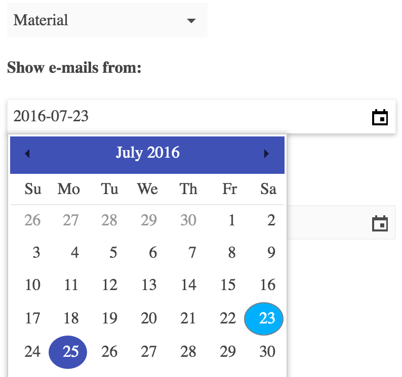
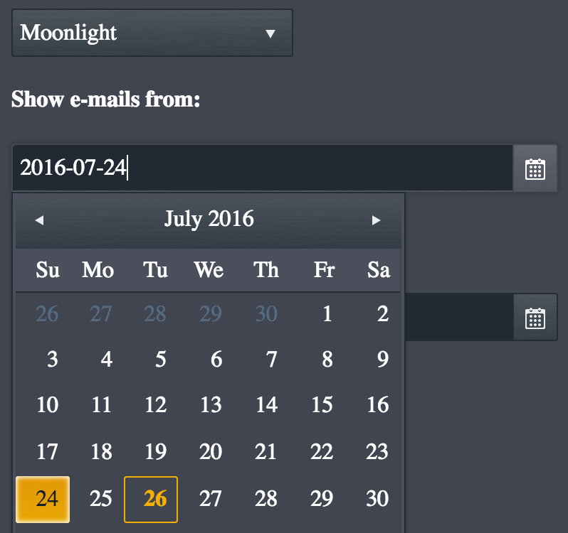
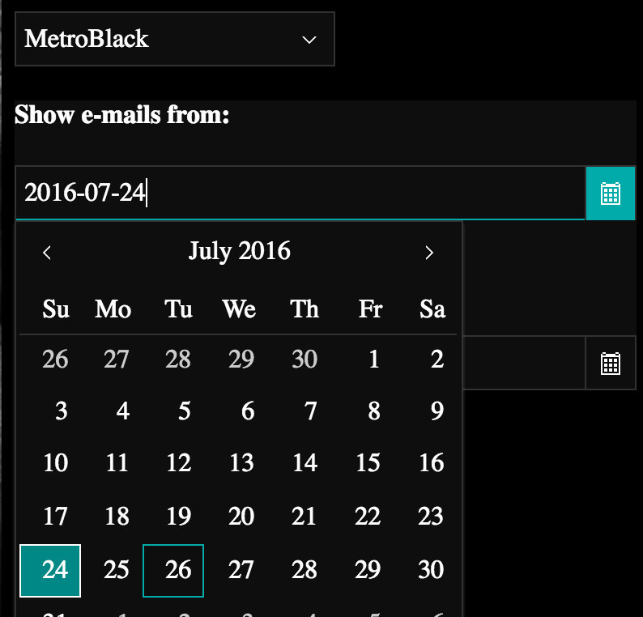
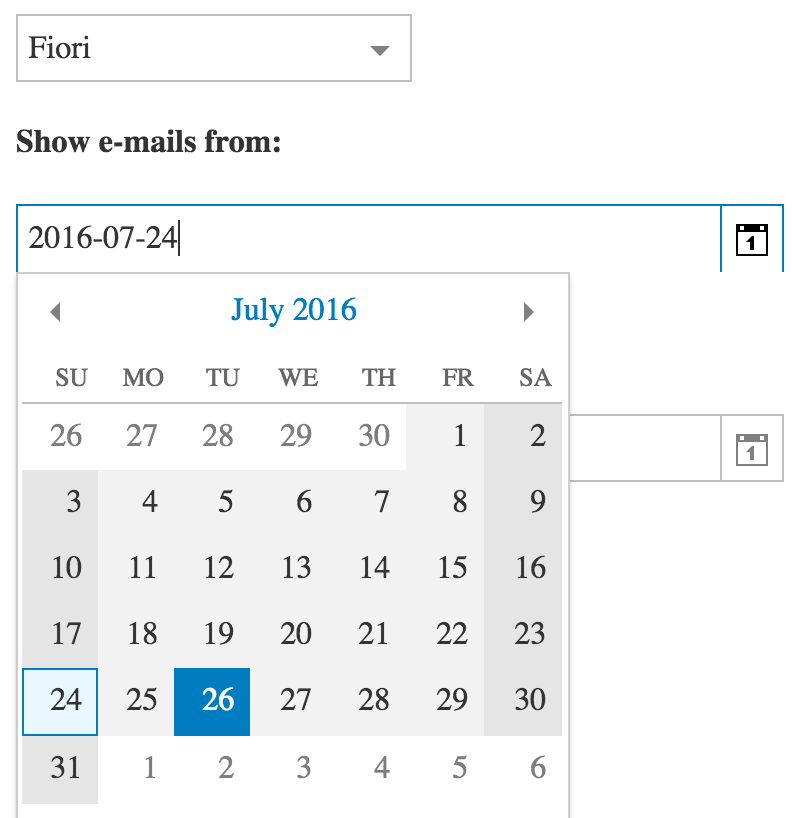
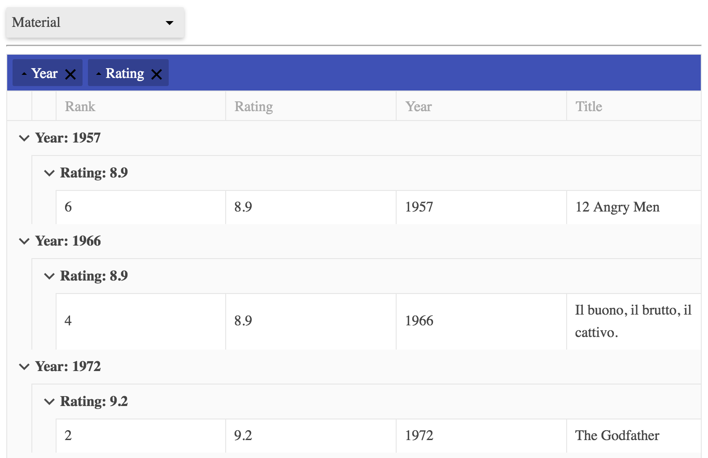
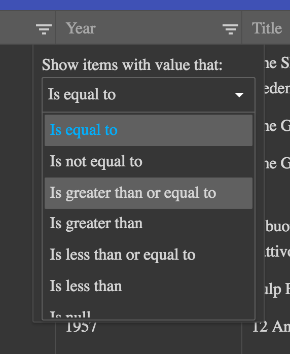

# Chapter 4: Kendo Grid


<!-- toc -->

- [Chapter 4: Kendo Grid](#chapter-4-kendo-grid)
	- [Interlude: Theme Roller](#interlude-theme-roller)
		- [Usage](#usage)
		- [Implementation](#implementation)
			- [DropDownList - Snake Case to CamelCase for the Props](#dropdownlist-snake-case-to-camelcase-for-the-props)
		- [Results](#results)
	- [The Kendo Grid](#the-kendo-grid)
		- [Schemas](#schemas)
			- [Using __pragma__('kwargs')](#using-__pragma__kwargs)
			- [And Doing it Better](#and-doing-it-better)

<!-- tocstop -->


We are going to invest more work into our `DataSource` class, so that it supports models and schemas.

To visualize the datasource's state, the powerful [Kendo Grid](http://demos.telerik.com/kendo-ui/grid/index) widget is ideal.

Downside: The widget is not included in the free Kendo core set but requires a **commercial license**. So, if you want to not only read but also continue to try the tutorial, please download an unrestricted trial license for free and place the files into the `lib_pro` folder as explained [there](./src/lib_pro/).

As already explained in the Readme I would be glad to get a note if someone integrates [`aggrid`](https://www.ag-grid.com/), [`OpenUI5`](https://openui5.hana.ondemand.com/#docs/api/symbols/sap.ui.layout.form.GridLayout.html), which are also great, if not better, plus free.

----
Lets change our baselibs to using full kendo-ui:

```html
<head>
    <title></title>
    <link rel="stylesheet" href="../lib_pro/styles/kendo.common.min.css" />
    <link rel="stylesheet" href="../lib_pro/styles/kendo.default.min.css" />
    <link rel="stylesheet" href="../lib_pro/styles/kendo.default.mobile.min.css" />
    <link rel="stylesheet" href="../lib_pro/styles/kendo.dataviz..min.css" />
    <link rel="stylesheet" href="../lib_pro/styles/kendo.dataviz.default.min.css" />
    <script src="../lib_pro/js/jquery.min.js"></script>
    <script src="../lib_pro/js/kendo.all.min.js"></script>
    <script src="__javascript__/pykendo.js"></script>
</head>

```
and quickly check if the stuff from the last chapter is still working.

Note: Since we (think) we understand Kendoui / Transcrypt integration mechanics, we are using minified sources now - but including all components (`kendo_all.min`).

## Interlude: Theme Roller

Before we get serious, first a little [Intermission](https://www.youtube.com/watch?v=O0wOD9TWynM): Lets add a theme roller widget. Why? Because we can.

Seriously: It is also instructive and me looking at the same pixels all the time I tend to get bored.

[Here](http://jsfiddle.net/gyoshev/Gxpfy/) is the blueprint.

### Usage

Thats how we want it:

```js
<body>
    <input class="themeroller" value="default" />
    <script>
      $ (document).ready(function() { pykendo.ThemeRoller('.themeroller');})
    </script>
```
### Implementation

We [see](http://jsfiddle.net/gyoshev/Gxpfy/) that it is based on kendo's dropdownList, so we first build this:

#### DropDownList - Snake Case to CamelCase for the Props

```python
~/demo/ch4 $ cat dropdownlist.py
# coding: utf-8
from kendo_base import KendoWidget
__pragma__('alias', 'jq', '$')

class DropDownList(KendoWidget):
    _functions = ['open', 'close', 'value']
    _k_cls = jq().kendoDropDownList.widget
    data_text_field  = 'text'
    data_value_field = 'value'
    data_source      = None
    height           = 500
```
as you can see we have longer key names for this widget and, as fundamentalist  Python programmers, we absolutely refuse to have lowerCamelCase in our code, right?

Good that we have our opts wrapper in the base class - there:
```python
if not tools.jstype(v, 'function'):
    if '_' in k:
        k = tools.camelize(k)
    jsopts[k] = v
```
with a new function in tools
```python
def camelize(s):
    ''' kendo wants camelCase, we want snake_case '''
    s = s.split('_')
    r = s[0]
    for part in s[1:]:
        r += part.capitalize()
    return r
```

The actual ThemeRoller we do like this (remember our `def on_<funcname>` mapping?)

```python
# coding: utf-8
import tools
from dropdownlist import DropDownList


class ThemeRoller(DropDownList):
    """ based one http://jsfiddle.net/gyoshev/Gxpfy/"""
    data_text_field  = "name"
    data_value_field = "value"
    height           = 500
    data_source = tools.name_value_pairs([
       [ "Black"        , "black"         ],
       [ "MaterialBlack", "materialblack" ],
       [ "MetroBlack"   , "metroblack"    ],
       [ "Office365"    , "office365"     ],
       [ "Uniform"      , "uniform"       ],
       [ "Nova"         , "nova"          ],
       [ "Moonlight"    , "moonlight"     ],
       [ "Meego"        , "meego"         ],
       [ "Material"     , "material"      ],
       [ "HighContrast" , "highcontrast"  ],
       [ "Flat"         , "flat"          ],
       [ "Fiori"        , "fiori"         ],
       [ "Bootstrap"    , "bootstrap"     ],
       [ "Blue Opal"    , "blueopal"      ],
       [ "Default"      , "default"       ],
       [ "Metro"        , "metro"         ],
       [ "Silver"       , "silver"        ]])

    def on_change(self, e):
        theme = self.value() or 'default'
        self.change_theme(theme)

    def change_theme(self, theme):
        __pragma__('js', '{}', '''    
    var doc = document,
        kendoLinks = $("link[href*='kendo.']",
        (... further js stuff changing the document css,
        taken as is from the fiddle,
        no need to sanit... I mean, Pythonize this.
        Yet ;-)
        ...''')
```

with

```python
def name_value_pairs(l):
    ret = []
    for k, v in l:
        ret.append({'name': k, 'value': v})
    return ret
```

in `tools.py` again.


### Results

We have nothing more to do to get all widgets consistently rendered in good number of predefined high quality themes (and you could bake your own, using their [theme builder](http://demos.telerik.com/kendo-ui/themebuilder/)).

<table><tr>
<td></td>
<td></td>
<td></td>
<td></td>
</tr></table>

Plus, we have an extendable dropdown list.

Personally I'm at a point where I must say that this is the best time I ever had with GUI programming.


## The Kendo Grid

After this recreational round, lets get busy again.

The [grid](http://demos.telerik.com/kendo-ui/grid/remote-data-binding) is the [most powerful](http://docs.telerik.com/kendo-ui/api/javascript/ui/grid) widget KendoUI has to offer.

If we master this we master everything ;-)

As with the datasource we create a custom specific instance based on the first example [here](http://demos.telerik.com/kendo-ui/grid/index) directly in our imported Transcrypt js.

*Later this will be part of an app.py framework.*

So in HTML we just call

```js
<div id="mygrid"></div>                                                
<script>$ (document).ready(function() { pykendo.MyGrid({}, '#mygrid')})</script>
```

while in pykendo we do:

```python
class MyGridDataSource(DataSource):
    # using the json fake server we set up before:    
    url = "http://localhost:3000/movies"

class MyGrid(Grid):
    data_source = MyGridDataSource()
    height = 550
    sortable = groupable = True
    pageable = {'refresh': True, 'pageSizes': True, 'buttonCount': 5}
    columns = [{'field': "rank",
                'title': "Rank",
                }, {
                'field': "rating",
                'title': "Rating"
                }, {
                'field': "year",
                'title': "Year"
                }, {
                'field': "title",
                'title': "Title",
                'width': 150
                }]

```
based on a `grid.py` looking for now like this:

```python
# coding: utf-8
from kendo_base import KendoWidget
__pragma__('alias', 'jq', '$')

class Grid(KendoWidget):
    _functions = []
    _k_cls = jq().kendoGrid.widget
```

and the feature to get parametrized via class vars only in `datasource.py`:

```python
def __init__(self, opts):
    if opts == undefined:
        opts = {}
    od = dict(opts)
    url = od.pop('url', self.url)
    transport = od['transport'] or self.transport
    if not transport:
        od['transport'] = {
                'read': {
                    'url': url,
                    'dataType': self._data_type}}
    KendoComponent.__init__(self, opts)
```

Running `~/demo/ch4/server $ json-server --watch db.json`, reloading the browser we get:




All right, lets further dig down the rabbit hole.

### Schemas

Straight forward adding of a schema parameter gives us e.g. type specific filters:

```python
class MyGridDataSource(DataSource):                                                                                                                             
    #type = 'jsonp'                                                                                                                                             
    url = "http://localhost:3000/movies"                                                                                                                        
    schema = {                                                                                                                                                  
            'model': {                                                                                                                                          
                'id': 'rank',                                                                                                                                   
                'fields': {                                                                                                                                     
                    'rank': {'type': 'number'}                                                                                                                  
                   ,'rating': {'type': 'number'}                                                                                                                
                   ,'year': {'type': 'number'}                                                                                                                  
                   ,'title': {'type': 'string'}                                                                                                                 
                   }}}                                                                                                                                          

```

and

```python
class MyGrid(Grid):                                                                                                                                             
    data_source = MyGridDataSource()                                                                                                                            
    height = 550                                                                                                                                                
    sortable = groupable = filterable = True           
```



#### Using __pragma__('kwargs')

I like this better than the string mess above, matter of taste...
```python
schema = d(model=d(                                                                                                                                         
			id='rank',                                                                                                                                      
			fields=d(                                                                                                                                       
				rank   = d(type='number')                                                                                                                   
			   ,rating = d(type='number')                                                                                                                   
			   ,year   = d(type='number')                                                                                                                   
			   ,title  = d(type='string'))))          
```

How is `d` working?

In CPython I often do it like: `def d(**kw): return kw` to get the effect.

To feed kendo though, we have to take care to return a pure JS map.
So this is the `d` function in Transcrypt:

```python
__pragma__ ('kwargs')
def d(**kw):
    __pragma__('js', '{}', '''
    var r = {}, v
    for (var k in kw) {
        v = kw[k];
        if (k == '__class__') continue
        if (typeof(v) != "function") {r[k] = v}
    }
    return r
    ''')
__pragma__ ('nokwargs')

```

so we locally told the Transcrypt interpreter to build all the mess required for kw args in python. Insert a tracepoint to appreciate the effort...

Performance wise: Hey, we are doing this once - for a full grid table. Forget the argument ;-)

#### And Doing it Better

after looking long enough at the js version with the pragmas, we gave this one a try:

```python
def d(*a):
    r = a[0]
    del r['constructor']
    del r['__class__']
    return r
````

and it works as well. Better that, no kwargs parsing bloat :-)
