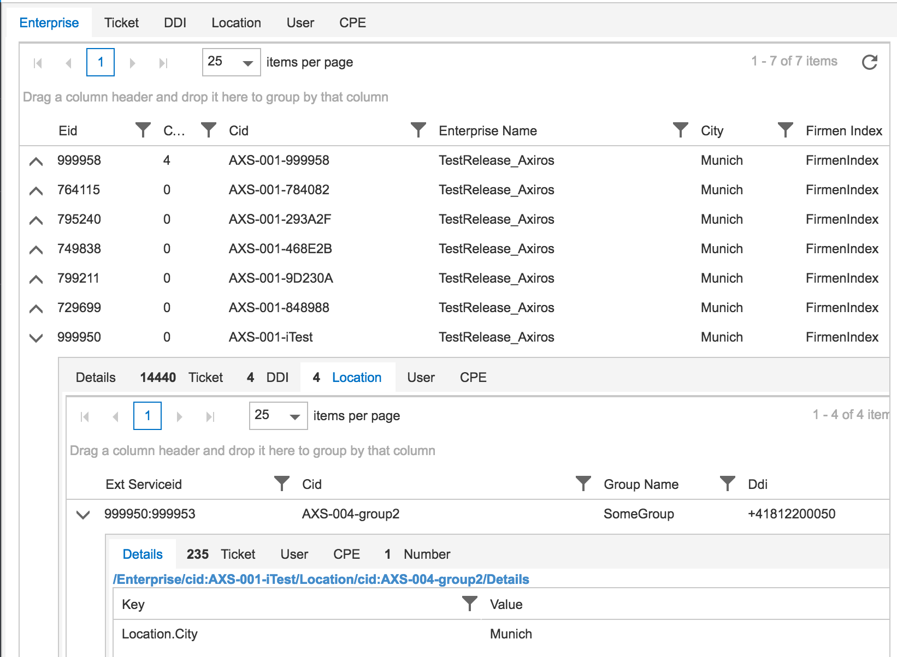

# Chapter 5: Nested Grids (Part 1)


<!-- toc -->

- [Chapter 5: Nested Grids (Part 1)](#chapter-5-nested-grids-part-1)
	- [Nested Lists of Data](#nested-lists-of-data)
	- [Test Data Meta Information](#test-data-meta-information)
	- [HTML](#html)
	- [TestServer](#testserver)
	- [Initialization](#initialization)
	- [Callback Hell?](#callback-hell)

<!-- tocstop -->


Now we are going to compose widgets to display complex data:

## Nested Lists of Data

This is a real life use case: On the server you have lists of data, related to each other in 1:n relations, i.e. a tree like set of tables. Could be data backed by relational databases, filesystems, whatever.

We don't focus on the server part and simulate the JSON Api via a simple Test server, rather try to see how effective we are creating many Transcrypt backed instances of complex Kendo Widgets.

The final result will sth like this - arbitrary deep nested arrangements of master detail grids, with each detail row offering "[tabstrips](http://demos.telerik.com/kendo-ui/tabstrip/index)" for the "child types" of a master record:




The server data API shall be fixed and we serve it via a little test server, located in the source code directory for this chapter.


## Test Data Meta Information

We've put some sample meta information about those nested tables into in importable module [here](./src/ch5/server/meta.py).

Important are the parent child relations:

```python
'childs_by_parent': [ ['Ticket',     ['TicketLog']],                                                                                                          
                      ['TicketLog',  []],                                                                                                                  
                      ['Enterprise', ['Ticket', 'DDI', 'Location', 'User']],                                                                                             
                      ['DDI',        ['Ticket']],                                                                                                                
                      ['Location',   ['Ticket', 'User', 'Number']],                                                                                         
                      ['User',       ['Ticket']],                                                                                                               
                      ['Number',     []]],                  
```
which means there is a child type ticket log below parent type ticket or e.g. Ticket below DDI.

Further the available master data columns are contained.

## HTML

This is how we want it:

```js
<div id="mygrid"></div>
<script>
      $ (document).ready(function() {
		  pykendo.NestedDataGrid({
                   'base_url': 'http://127.0.0.1:8081/v1'}, '#mygrid')})
</script>
```

and the base_url shall deliver the meta data when hit with Content-Type `appl./json`. Then the first tabstrip shall be built


## TestServer

we've a `bottle.py`](http://bottlepy.org/docs/dev/api.html) into our server directory and serve the meta data as follows. As you can see we also serve all static files of the app from this server, since we ran into some same-origin problems with datatype json and a different server for data than for the app. Will investigate later.

```python
~/GitHub/misc_transcrypt/doc/kendo/src/ch5 $ cat server/server.py
#!/usr/bin/env python2.7

from bottle import static_file
@route('/app/<filepath:path>')
def server_static(filepath):
    return static_file(filepath,
	       root='/Users/klessinger/GitHub/misc_transcrypt/doc/kendo/src')


import json
from bottle import route, run, template, response
def j(data):
    response.add_header('Content-Type', 'application/json')
    return json.dumps({'data': {'post': data}}, indent=2, sort_keys=True)

@route('/v1')
def index():
    from meta import meta
    return j(meta)

run(host='localhost', port=8080, reloader=True)
```

using the [good](http://lucumr.pocoo.org/2014/5/12/everything-about-unicode/) Python [version](https://felipec.wordpress.com/2013/10/07/the-linux-way/).


Verification with the browser on `http://127.0.0.1:8080/v1` delivers

```js
{
  "data": {
    "post": {
      "DDI": {
        "columns": [
          {
            "field": "PhoneNumberStart",
            "title": "Phone Number Start",
            "width": "14em"
            ...

```

while `http://127.0.0.1:8080/app/ch5/demo.html` delivers the app.


## Initialization

For now we build the whole thing again directly in our `pykendo.py`, for convenience.

```python
from tools import d
class NestedDataGrid:
    base_url = None
    def __init__(self, opts, selector):
        self.selector = selector
        self.base_url = opts.base_url
        read = datasource.read(self, self.base_url, self.got_data)
        self.data_source = DataSource(d(read=read))

    def got_data(self, result, mode, opts):
        self.schema = d = result.data.post
        self.type
        # make the datasource happy:
        opts.success(d)
```
where we invested some further work in our datasource, using the `post_init` hook from earlier,
which will be called just before instantation but after the attrs are set:

```python
from kendo_base import KendoComponent
from tools import d
# test urls
get_list = 'http://127.0.0.1:3000/posts/'

__pragma__('alias', 'jq', '$')

def read(cb_handler, url, success, error):
    success = success or cb_handler.success
    error   = error or cb_handler.error
    def ajax():
        opts =d(type='get', dataType='json', data=d(), url=url,
                success=success, error=error)
        return jq.ajax(opts)
    return lambda: ajax()


class DataSource(KendoComponent):
    '''
    http://docs.telerik.com/kendo-ui/api/javascript/ui/datepicker#fields-options
    '''
    _k_cls = kendo.data.DataSource
    data = None
    page_size = 20
    url = None
    _data_type = 'json'

    transport = None
    _functions = ['read']
    def __init__(self, opts):
        if opts == undefined:
            opts = {}
        od = dict(opts)
        KendoComponent.__init__(self, opts)
        self.read()

    def post_init(self):
        ''' lets see what we got from the caller '''
        if self.data or self.tranport:
            return
        self.transport = t = {}
        if self.read:
            t['read'] = self.read
        elif self.url:
            t['read'] = d(url=self.url, dataType=self._data_type)

    def on_change(self, *a):
        print('data changed')


```

the `read` function delivers, as a parameter for the transport, a lambda for `jquery.ajax`,
which is what kendo actually does.

* We did that to have more transparency about the actual datatransfer, plus some data postprocessing possibilities - e.g. Kendo default read method has a problem if we don't send back a list, like hier fuer our initial schema.*

## Callback Hell?

The read function is getting a ref to the caller and success and error callbacks, which it directly invokes after data is local.

Asides from the fact that it took an hour(!) to write those few l.o.c.:
I don't like the whole design, i.e. the fact that widgets would do data transfer on their own, with callback invocation time and local GUI updates dependent on network and server state.

Imagine more than one of those widgets hitting the server in parallel and update stuff in the browser which might be out of order dependent on network time?!


We want sth better. We want [THIS](https://gist.github.com/staltz/868e7e9bc2a7b8c1f754).

We do an intermediate chapter to set up that infrastructure.
