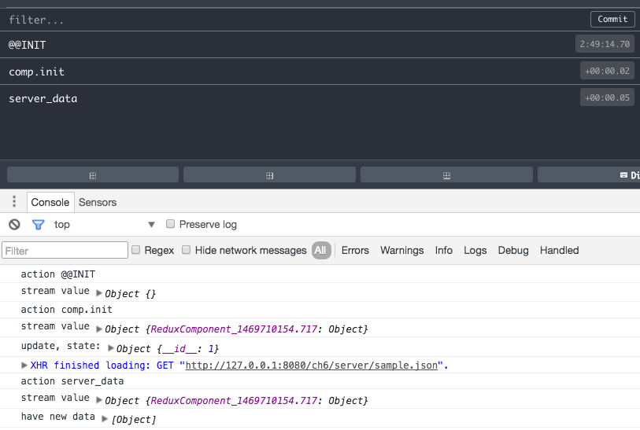

# Reactive Programming / Stream Processing / Redux


<!-- toc -->

- [Reactive Programming / Stream Processing / Redux](#reactive-programming-stream-processing-redux)
	- [Experiments](#experiments)
		- [Stream Processing](#stream-processing)
				- [lambdas anyone?](#lambdas-anyone)
	- [Streams containing Objects?](#streams-containing-objects)
	- [Redux](#redux)
		- [Why is this better?](#why-is-this-better)
	- [FRT: (FRP, Redux, Transcrypt)](#frt-frp-redux-transcrypt)
		- [Setup](#setup)
			- [Implementation](#implementation)
		- [Transcrypt Dicts versus JS Dicts](#transcrypt-dicts-versus-js-dicts)
		- [Actions](#actions)
		- [Immutable State](#immutable-state)
		- [First Redux App Design Including Async Component Updates](#first-redux-app-design-including-async-component-updates)
	- [Houston, We Have a Problem](#houston-we-have-a-problem)

<!-- tocstop -->


As an API lib for handling the streams we chose this one: [kefirks](https://rpominov.github.io/kefir/). Why? Because the simplicity of it was very attractive, check the website.


## Experiments

### Stream Processing

First we try the stream processing within Transcrypt:

With a `<script src="../lib_pro/3rd/kefir.js"></script>` and a `$ (document).ready(function() { pykendo.test_kefir()})` in the HTML we try:


```python
def log(x):
    console.log(x)
def test_kefir():
    numbers = Kefir.sequentially(1000, [1,2,3])
    def f(x):
        return x * 2
    numbers2 = numbers.map(f)
    def f2(x):
        return x != 4
    numbers3 = numbers2.filter(f2)
    numbers3.onValue(log)
```

and get `2` and after 2 secs a `6` on the console.
Nice!

##### lambdas anyone?

If the functions of your stream processing chain are short, this is a nicer way to write them:

```python
def log(x):
    console.log(x)
def test_kefir():
    numbers = Kefir.sequentially (1000, [1,2,3])
    numbers2 = numbers.map       ( lambda x: x *  2)
    numbers3 = numbers2.filter   ( lambda x: x != 4)
    numbers3.onValue             ( lambda x: console.log(x))
```

## Streams containing Objects?

In to following, when we say 'object' we do mean anything which is not 1:1 serializable. A plain javascript '{'a': 'b'}' or arrays with those or primitives is serializable.
In other words:
*Anything which you can `json.dumps` without an object hook and get it back at `loads` is not an object in the following.*

A widget instance is an object.

So, we could do stream processing based server communication like this:

1. widget fires event (e.g. load, mouse click...) into a stream, say stream1, triggering an ajax call in a .map function, subscribes to response stream.
2. response stream (using e.g. [this](https://github.com/elsehow/kefir-jquery-ajax)) is being "merged" (a stream operation) with stream 1, so that we have the widget object *and* the data at hand
3. we update the widget with the data

Anybody could subscribe to the response stream, so that we have at least a decoupling here, the sender does not need to know about who is subscribed.

But do we actually need the widget objects within the streams to update them once data is available?

Actually no: Better is this design:

## Redux

1. widget instantiates, gets an id, registers at an app wide id to object cache.

2. event stream without objects but ids emerges from the widgets

3. causing e.g. async server comm.

4. causing a central data only store to update

5. causing another observable stream on that store to update the widgets one by one, with the data in the store and the widget from the cache via the ids which are serializable, so in the store.

### Why is this better?

The store contains the primary data (state) for the whole app. You can snapshot it and recreate the whole app from it. Every rendering process of all widgets is based on one consistent state.


Looking around we find that the javascript community is currently (2016) pretty fond of that design as well and the central lib to realize that is called [Redux](http://redux.js.org/docs/basics/Store.html).

The concept again:
*Put the primary data, to derive GUI state from within one central not mutable model - and derive everything from it.*


Enough talking, lets do that now.

## FRT: (FRP, Redux, Transcrypt)

### Setup

Add `https://github.com/zalmoxisus/redux-devtools-extension` to chromium or FF, simple Extension install.

Add
```html
 <script src="../lib_pro/3rd/kefir.js"></script>
 <script src="../lib_pro/3rd/redux-kefir.js"></script>
 <script src="../lib_pro/3rd/redux.min.js"></script>
````

#### Implementation

in pykendo:

```python
def log(x):
    console.log('stream value', x)

def create_redux(reducer, init_state):
    c, k = Redux.createStore, ReduxKefir.observableMiddleware
    c = Redux.applyMiddleware(k)(c)
    return c(reducer, init_state)

class ReduxApp:
    store = None
    def __init__(self):
        self.store = create_redux(self.reducer, d(a='b'))
        # s_ -> a stream
        self.s_store = ReduxKefir.createProjection(self.store)

    def reducer(self, state, action):
        return state

app = ReduxApp()
app.s_store.onValue(log)
debugger
```

which gives us `stream value Object {a: "b"}` on the console - which means that the store state is observable by kefir.

### Transcrypt Dicts versus JS Dicts

Note, that we sent a plain js object into the redux store, not a Transcrypt object although we could (via the `d` function from `tools.py`). We think this is important to keep the store serializiable.

For the serious reader, this is a Transcrypt convenience wrapped dict:
, here just for the serious readers, what is a Transcrypt dict:


```js
~/GitHub/GKTranscrypt/transcrypt/modules/org/transcrypt/__javascript__ $ cat __builtin__.mod.js
(...)
function dict (objectOrPairs) {
    if (!objectOrPairs || objectOrPairs instanceof Array) {	// It's undefined or an array of pairs
        var instance = {};
        if (objectOrPairs) {
            for (var index = 0; index < objectOrPairs.length; index++) {
                var pair = objectOrPairs [index];
                instance [pair [0]] = pair [1];
            }
        }
    }
    else {													// It's a JavaScript object literal
        var instance = objectOrPairs;
    }

    // Trancrypt interprets e.g. {aKey: 'aValue'} as a Python dict literal rather than a JavaScript object literal
    // So dict literals rather than bare Object literals will be passed to JavaScript libraries
    // Some JavaScript libraries call all enumerable callable properties of an object that's passed to them
    // So the properties of a dict should be non-enumerable
    Object.defineProperty (instance, '__class__',  {value: dict           , enumerable: false, writable: true});
    Object.defineProperty (instance, 'keys',       {value: __keys__       , enumerable: false});
    Object.defineProperty (instance, '__iter__',   {value: __keyIterator__, enumerable: false});
    Object.defineProperty (instance, 'items',      {value: __items__      , enumerable: false});
    Object.defineProperty (instance, 'del',        {value: __del__        , enumerable: false});
    Object.defineProperty (instance, 'clear',      {value: __clear__      , enumerable: false});
    Object.defineProperty (instance, 'setdefault', {value: __setdefault__ , enumerable: false});
    Object.defineProperty (instance, 'py_pop',     {value: __pop__        , enumerable: false});

    return instance;
}
__all__.dict = dict;
dict.__name__ = 'dict';
(...)
```


Maybe later, while handling we decide that the want Transcrypt wrapped dicts in it, we'll see, its an either or decision - do we deserialize back into plain js dicts or, via a middleware into Transcrypt dicts (and arrays).
For now we do method 1 and well wrap the values into Transcrypt dicts on demand, e.g. when we need `.items`.


### Actions

Lets send stuff into the store.

```python

    def reducer(self, state, action):
        console.log('action', action.type)
        d = action.data
        if d:
            __pragma__('js', '{}', '''
            for (var k in d) {
            state[k] = d[k]}
            ''')
        return state

app = ReduxApp()
app.s_store.onValue(s_log)
app.store.dispatch(d(type='test', data=d(foo='bar')))
debugger
```

as you can see its a bits awkward to work with plain js objects (also here we forgot to create a new state but mutate the existing one - a no-go).

Lets check first what would happen if we DO Transcrypt dicts?

```python
diff -r 0cdb549a0041 pykendo.py
--- a/pykendo.py	Thu Jul 28 01:07:17 2016 +0200
+++ b/pykendo.py	Thu Jul 28 01:09:57 2016 +0200
@@ -36,7 +36,7 @@
 class ReduxApp:
     store = None
     def __init__(self):
-        self.store = create_redux(self.reducer, d(a='b'))
+        self.store = create_redux(self.reducer, {'a': 'b'})
         # s_ -> a stream
         self.s_store = ReduxKefir.createProjection(self.store)

@@ -44,15 +44,13 @@
         console.log('action', action.type)
         d = action.data
         if d:
-            __pragma__('js', '{}', '''
-            for (var k in d) {
-            state[k] = d[k]}
-            ''')
+            for k in d.keys():
+                state[k] = d[k]
         return state

 app = ReduxApp()
 app.s_store.onValue(s_log)
-app.store.dispatch(d(type='test', data=d(foo='bar')))
+app.store.dispatch({'type': 'test', 'data': {'foo': 'bar'}})
 debugger
```


Interesting. No big problem here.

### Immutable State

The state dict must be mutated with every action, otherwise the observer will not see an event.

How deep do we go. Redux [suggests](https://www.reddit.com/r/reactjs/comments/4416ea/redux_app_state_deep_or_flat/) to do a flat state - otherwise the deep copying required to not override data deep in nodes can get expensive.


```python
def reducer(self, state, action):
    console.log('action', action.type)
    ns = {}
    for k, v in state.items():
        ns[k] = v
    d = action.data
    if d:
        for k in d.keys():
            ns[k] = d[k]
    return ns
```


In the final design, we'll go 2 level deep:

```json
{<component id>: {key1: v1, key2: v2, data: ...}}
```

where by convention we define a key `data` which we can convenience handle, see below.


Lets try first the dev tools middleware after creating new state in the reducer:


```python
@@ -31,29 +31,33 @@
 def create_redux(reducer, init_state):
     c, k = Redux.createStore, ReduxKefir.observableMiddleware
     c = Redux.applyMiddleware(k)(c)
-    return c(reducer, init_state)
+    wd = window.devToolsExtension
+    if wd:
+        return c(reducer, init_state, wd())
+    else:
+        return c(reducer, init_state)
```

and check it out:


Thats working, we can go back in time via the slider.

If we export, we get sth like this

```json
~/Downloads $ cat state.json | python -m json.tool
{
    "actionsById": {
        "0": {
            "action": {
                "type": "@@INIT"
            },
            "timestamp": 1469662408265,
            "type": "PERFORM_ACTION"
        },
        "1": {
            "action": {
                "data": {
                    "foo": "bar"
                },
                "type": "test"
            },
            "timestamp": 1469662408280,
            "type": "PERFORM_ACTION"
        }
    },
    "committedState": {
        "a": "b"
    },
    "computedStates": [
        {
            "state": {
                "a": "b"
            }
        },
        {
            "state": {
                "a": "b",
                "foo": "bar"
            }
        }
    ],
    "currentStateIndex": 1,
    "monitorState": {},
    "nextActionId": 2,
    "skippedActionIds": [],
    "stagedActionIds": [
        0,
        1
    ]
}

```

which is *pretty* nice, it dumps as our convenience wrapped Transcrypt dicts had been actual js dicts and thats where all of Jacques' thinking effort into the core of Transcrypt really pays off.

That in turn makes me create a `d` function returning Transcrypt dicts and I rename the old `dj`, for javascript dicts:

```python
def d(*a):
    ''''
    deep = d(foo=d(bar=42)) => deep = {'foo': {'bar': 42}}
    with the map a pure js obj.
    '''
    r = a[0]
    if not r:
        return {}
    return dict(r)


def dj(*a):
    ''''
    deep = d(foo=d(bar=42)) => deep = {'foo': {'bar': 42}}
    with the map a pure js obj.
    '''
    r = a[0]
    if not r:
        __pragma__('js', '{}', 'return {}')
    del r['constructor']
    del r['__class__']
    return r
```

### First Redux App Design Including Async Component Updates

As discussed a component shall get its result from the store observer, when the data has arrived.

For this the redux store keeper (which is the app object) needs to have them registered by id.

Here the design:


```python
class ReduxApp:
    store = s_store = None
    components_by_id = None
    def __init__(self):
        self.create_store_and_components_registry()

    def create_store_and_components_registry(self):
        self.components_by_id = {}
        initial_state = {}
        self.store = create_redux(self.reducer, initial_state)
        # s_ -> a stream
        self.s_store = ReduxKefir.createProjection(self.store)
        self.s_store.onValue(self.update_components)

    def dispatch(self, type, comp_id, kvs):
        ''' updating of a single components state '''
        # will trigger call of redux to reducer:
        self.store.dispatch({'type': type, 'data': {comp_id: kvs}})

    def reducer(self, state, action):
        ''' job of this one is to build a new state for the store, based on its
        current state and an action with type and state data '''
        console.log('action', action.type)

        ns = {}             # new state - from old state:
        ns.update(state)
        # and action data:
        d = action.data
        if not d:
            return ns
        for comp_id, kv in d.items():
            comp = self.components_by_id[comp_id]
            if comp:
                cstate = comp.state
                cns = {} # new component state
                cns.update(cstate)
                cns.update(kv)
                cns['__id__'] += 1
                ns[comp_id] = cns
        return ns

    def update_components(self, x):
        s_log(x)
        s = self.store.getState()
        for id, comp in self.components_by_id.items():
            store_cstate = s[id]
            if comp.__state_id__ != store_cstate.__id__:
                data = store_cstate.data
                comp.__state_id__ = store_cstate.__id__
                # convenience for the comps: provide a new_data hook ,saves
                # some ifs in the comps:
                if data and comp.state.data != data:
                    comp.state = store_cstate
                    comp.new_data(data)
                else:
                    comp.state = store_cstate
                    comp.update()


    def register_component(self, comp):
        self.components_by_id[comp.id] = comp
        # here, app may still freely mutate the state, e.g. pull from server:
        # via self.ajax, we have the comp object
        # for now we accept it as is, and this will trigger the comp.update:
        self.dispatch('comp.init', comp.id, comp.state)


    def ajax(self, comp, meth, send, url):
        def success(data, mode, props):
            id, app = this.comp.id, this.app
            app.dispatch('server_data', id, d(data=data))

        opts = dj(type=meth, url=url,
                dataType='json', data=send,
                success=success, error=success,
                context=dj(comp=comp, app=self))
        jq.ajax(opts)


# app = globally available:
app = ReduxApp()
#app.store.dispatch(d(type='test', data=d(foo='bar')))

import time, random
class ReduxComponent:
    ''' A ReduxApp Component with
    - an id
    - serializable primary state
    state can be set by the app, also async.
    '''
    id = state = None
    __state_id__ = 0
    def __init__(self):
        self.register()

    def register(self):
        if not self.id:
            self.id = self.__class__.__name__ + '_' + time.time()
        if not self.state:
            self.state = {}
        # state id, updated at each change. useful for quick diffs in the
        # update_all:
        self.state['__id__'] = self.__state_id__
        app.register_component(self)

    def update(self):
        """ in zope this would be __set_state__ -
        we have our state and create the view """
        console.log('update, state:', self.state)

    def ajax(self, meth, send, url):
        app.ajax(self, meth, send, url)

    def new_data(self, data):
        console.log('have new data', data)


c = ReduxComponent()
c.ajax('get', {}, '/ch6/server/sample.json')


```

where:
- every component has an id and a
- `state` dict, which is in the store, mapped by the component id
- the component state dicts have an __id__ field, which is updated with every state change by the reducer function
- also the component has a __state_id__ field with, when updated, having the same value than `self.state.__id__`
- the app's `update_all` function just compares the __id__ field of a component with that of its store id, to know if it should call `.update()` on the component
- if there is a (server) data update, then app will call a convenience function `new_data` on the component.

Here a shot when Running




## Houston, We Have a Problem

When we use the timeslider we can go back to init time of the component but not further back:

It crashes here:

    if (comp.__state_id__ != store_cstate.__id__)

The store does not contain the id any more but the app's mutable id to object cache does.

What to do?

Should we, when going back in time destroy and create components? I think thats a no go, since e.g. at create server data backed components would dispatch new async actions (while processing the state update) => a mess.

This gets us into the interesting area of **Routing**
