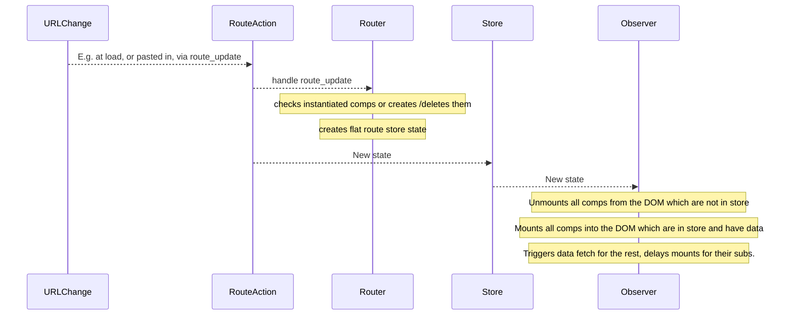

# Routing


<!-- toc -->

- [Routing](#routing)
	- [Principal State versus Primary State](#principal-state-versus-primary-state)
	- [Async Instantiation](#async-instantiation)
	- [Simple Renderer](#simple-renderer)
	- [Router First FuncSpec](#router-first-funcspec)
			- [Sync Routing](#sync-routing)
		- [Async Routing: Data Backed Components Have Exactly One Endpoint - A Valid Assumption ?](#async-routing-data-backed-components-have-exactly-one-endpoint-a-valid-assumption)
			- [Achievements](#achievements)
	- [Route Updates](#route-updates)
		- [Auto Unmount](#auto-unmount)
		- [Addressing a Merging Problem](#addressing-a-merging-problem)
		- [Updates from URL Changes](#updates-from-url-changes)
- [Better Implementation](#better-implementation)

<!-- tocstop -->


[This](http://jamesknelson.com/simple-routing-redux-react/) is a good read.


Our first high level design:


We see we have to solve a few things:

## Principal State versus Primary State

All primary state must be in Redux, the complete state of the app must be re-creatable from it. E.g. the fact that a dropdown list is open after a mouse click means that the open state must be in Redux.

But there are values which are "more primary" than others: those which the user expects to be set when he enters a route - and those we call principal params, those which are understood in URLs. A dropdown state is normally not principle, while the id of the records displayed within the dropdown options is.

It would be nice to decide via simple adding to a list which params are principle and by simply doing that the routes will be built and understood accordingly.


## Async Instantiation

Say our route parametrizes two nested components. The second one can only be mounted when the first has the data (see kendo detail grid). That means that URL -> Component tree via router can't be done in one syncronous function, but must be step by step with parent components signaling to router that they are ready for it to instantiate the component, deeper in the tree. That does not apply to components which don't need server data though.


Lets do this now.

First a simple helper to render our components:

## Simple Renderer

We put the redux component related classes into a module and create a little state renderer into the DOM, so that we see the updates:

```python
from redux import ReduxApp, ReduxComponent

class PlainStateRenderer:
    """ depends on us being also a Redux Component with state."""
    template = '{state}'
    selector   = None
    _mp  = None
    _rendered_state_id = None # id of last render

    def __repr__(self):
        s = self.__class__.__name__
        if self.selector:
            s += '@' + self.selector
        return s

    def get_html(self):
        html = '<b>' + self.__repr__() + '</b>'
        for k, v in self.state.items():
            html += '<br>   ' + k + ': ' + v
        return html
    html = property(get_html)

    def dom_mount(self):
        self._mp = jq(self.selector)
        self._mp.html(self.template.format({'state': self.html}))

    def dom_update(self):
        ''' re-render after state updates '''
        if self.state._id_ == self._rendered_state_id:
            return

        if not self._mp:
            self.dom_mount()
        else:
            self._mp.html(self.template.format({'state': self.html}))


class MyApp(ReduxApp, PlainStateRenderer):
    template = '{state}<hr><div id="comp1"></div>'


class MyComp(ReduxComponent, PlainStateRenderer):
    pass


def run(sel):
    app = MyApp('#mygrid')
    mc = MyComp('#comp1')
    mc.ajax('get', {}, '/ch7/server/sample.json')
```

</img>

We can follow the state updates using the debugger. data is already fetched async from the server.

## Router First FuncSpec

Now more realistic, using the router.

Important is to not think in terms of URLs but in terms of data structures, the router has to act upon.

So for now we don't care about route parameter serialization into one string with slashes as seperators (see `uniloc.js`) but will deserialize a json structure from the URL, as is. Later we'll find a clever serialization format.


Given a setup like

```python
class App(RC, PSR):
    template = '<div id="top"/>{state}<hr><div id="main">hello world</div>'

class Top(RC, PSR):
    template = 'Top {state}<hr>'

class Comp1(RC, PSR):
    template = 'Comp1 {state}<hr><div id="sub"></div>'

class Comp2(RC, PSR):
    template = 'Comp2 {state}<hr><div id="sub"></div>'

class MyApp(ReduxApp, ReduxRouter):
    ''' woraround to get nested classes, not in TS currently '''
    App = App
    Top = Top
    Comp1 = Comp1
    Comp2 = Comp2

route = {
    "#mygrid": {
        "cls": "App",
        "#main": {
            "cls": "Comp1",
            "state": {
            "id1": "bar"
            },
            "#sub": {
            "cls": "Comp2",
            "state": {
                "id2": "foo"
            }
            }
        },
        "#top": {
            "cls": "Top"
        }
    }
}

def run(sel):
    app = MyApp(d(route=route))
```


This should be rendered like follows:

 1. MyApp
 1. Top at app's #top
 1. Comp1 at app's #main
 1. Comp2 at comp1's #sub

**but, as a complication (anticipating that the #sub mount point will only be available when Comp1 has the data) we want the Comp2 instantiation & mounting only be done once Comp1 has that data(!)**

How do we do that. I think only the component itself can know if the subs can be instantiated in sync (like: app knows that top can be instantiated right away) or if data is missing.

In other words:
The router must instantiate Comp2 only once he 'sees' that Comp1 has its data.


Other example: Top has a dropdown for the user's last emails or alerts. Data to be loaded.

While top may know that e.g. its user session drop down list requires data, it will need to provide a flag to the router that he should go deeper only once data is there.

#### Sync Routing

The sync version of the routing, i.e. when it instantiates the whole tree is pretty much straight forward to do.

</img>


*[Commit](https://github.com/axiros/misc_transcrypt/commit/96ae3dd285208531b793c7e317afbb2b39251d30), redux.py and pykendo.py are the interesting modules.*


As you can see from the shot we went away from random instance IDs to IDs derived from hierarchy, classname and principal state parameters and their values.


### Async Routing: Data Backed Components Have Exactly One Endpoint - A Valid Assumption ?

Is it valid to assume that a component requires either data, then route realization is only complete once data is there - OR it has no data and then it can be syncronously completed.

In other words: Isn't it bad design to have components with more than one data backing endpoints on the server? We think yes. E.g. a top bar with a user email dropdown and a general server state dropdown should be designed with two subcomponents which are individually data-backed but not as one big component.


We try that assumption and go with this first Router implementation:

</img>

*[Commit](https://github.com/axiros/misc_transcrypt/commit/090b3e5) ('async router'), again redux.py and pykendo.py are the interesting modules and also the renderer.*

#### Achievements

1. The second component is instantiated and updates the DOM only when the first component has data
1. If you try the time slider you'll see that the components neatly mount and unmount into/from the DOM
1. The state of the components remains stored, so no new data fetches when going back, then forward in time, since its the router itself how, when no data is present, triggers the fetch

This is what we do at store updates:

```python
rs = self.r_state
if rs == self.r_active:
	return
call = 0
if s.action == 'server_data' and rs == self.r_waiting:
	call = 1
if s.route != self.cur_route and rs == self.r_inactive:
	call = 1
if call:
	console.log('calling router')
	self.set_router_state(self.r_active)
	self.realize_route(self, s.route)
	if self.r_state != self.r_waiting:
		self.cur_route = s.route
		self.set_router_state(self.r_inactive)
```
- There are 3 states, inactive, active (in a routing process) and waiting (for server data).
- When we are within a routing process (our router state is active) then we dont' jump in again into realize_route.
- If we have server data and the router is in waiting state we enter it.
- The routing itself (`realize_route`) is always a 100% sync. function, triggering component instantiations and data fetches.


## Route Updates

Lets now extend our router to understand dynamic route injections (and fixing a bug in the deep copy).

[Here](https://github.com/axiros/misc_transcrypt/commit/d06918a) the commit. After a second, Comp2 within Comp1 is exchanged with another instance of Top, due to

```python
app = MyApp(d(route=route))
window.app = app
def f():
	app.foo = 1
	app.dispatch('route_update', 'route',
		{'#mygrid':
			{'#main':
				{'#sub': {'cls': 'Top'}}}})
window.setTimeout(f, 1000)
```

and the time slider works like expected.


### Auto Unmount

Question left: When we inject a route for a new component (like here 'Top') on a place where another one resides (like here div '#sub' within Comp1), should we better call unmount on the old one before creating the new one?

Can't really explain why but have the gut feeling that we should.

[Here](https://github.com/axiros/misc_transcrypt/commit/e3f9792) is the change, which unmounts recursively all components previously mounted.

### Addressing a Merging Problem

Looking closely we find that a `route_update` induced swap of Comp2 with Top produced a funny principal state for Top: A *merge* of previous Comp2 principal state with that of Top.
Clear, we handle the route updates via deep copies and jquery.extend did exactly that.

[This](https://github.com/axiros/misc_transcrypt/commit/90d2ed2) fixes that, using lodash's wonderful `mergeWith` function.

```python
if comp_id == 'route':
	 def f(t, s):
		 # avoid merging state!
		 if 'state' in s:
			 for k in s.keys():
				 t[k] = s[k]
	 lodash.mergeWith(ns, action.data, f)
```
As you can see we even allow, as a feature, to transfer the principal state of the old component into the new one - if you omit the state map in the route_update.


### Updates from URL Changes

and we realized we got a few things wrong in this first implementation...

# Better Implementation

The first implementation led to problems with the time slider: The router did his route checking and even data downloading from the reducer - and this is clearly wrong.

We learned that the reducer really exclusively has to job to deliver a new store state but not trigger actions which cause inline action dispatches again (requiring a router.is_active flag to not end in loops).

In the next iteration we solved that and really only update the state from the `route_update` action - while and DOM related and data fetching action is done in the observer.

Have look at the [code](https://github.com/axiros/misc_transcrypt/commit/d14cd80).

Most notable difference is that
- the reducer only updates the store to a state where only components are in which require materialization into the DOM (mabye with an in-between server_data action, async)
- data data structure for storing all routes became flat (while route updates are still nested, for convenience)
- the observer handles DOM updates and data fetches



after data is present the rest of the components is mounted.
